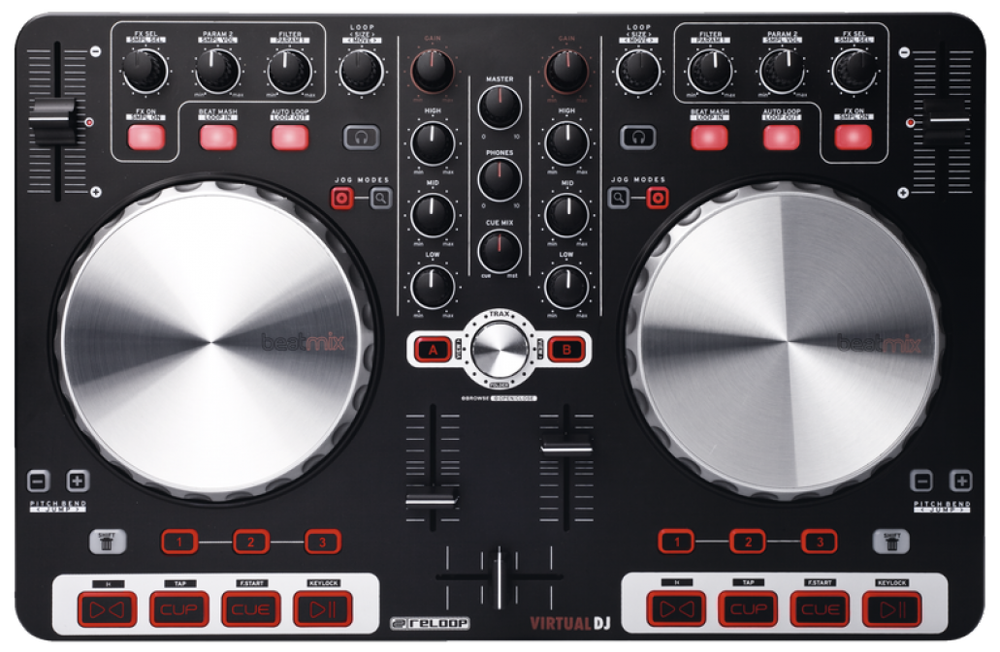

# Reloop Beatmix mapping for Mixxx

This repo contains Mixxx mapping for Reloop Beatmix gen. 1 DJ controller. It is identical to one pulled to Mixxx itself, so if you have it there you probably don't need this mapping.

## What's Reloop Beatmix?

It is a mid-sized twpo decker DJ controller meant to manipulate DJ software such as Traktor or Mixxx. It is quite old and now discontinued but still a good balance of functions and size. It works with Virtual DJ, it is supported in Traktor Pro. Here's the product page: [https://www.reloop.com/reloop-beatmix](https://www.reloop.com/reloop-beatmix)

## What's Mixxx?

This mapping files are adding support for this hardware to Mixxx DJ software. Mixxx is a great free and opensource DJ software that run on all operating systems and have just about everything a DJ software should have. You should definitely give it a try! You can find more about it on [Mixxx's website](https://mixxx.org).

## Functions implemented

All, except sampler controls. There are several changes in comparsion to what manufaturer had in mind when creating the device. Here's the list of things:

1. Scratch toggle buttons on the controller are confusing. There's no problem with buttons itself but LEDs are controlled by hardware itself. There is a way to catch button click, but i didn't find the way to control LEDs, so it seems impossible to make these LEDs correspond correctly with current mode of operation. So i just gave up on these buttons. Instead, scratch mode switched and indicated with Shift-Load buttons which lights i could actually toggle.
2. Second jog mode buttons (w search icon) have a function. Those make jogs four times more sensitive when enabled. This does not affect scratch, mut makes search and tempo correction much faster.
3. I have no idea what "Beat Mash" is (buttons right above jogs), so these buttons toggle quantize mode instead.
4. There is no fader start feature in Mixxx, but i managed to make it work with scripts. There is no fader stop functionality on it and it is done intentionally. I don't want you to use fader start as a samples control as this shortens fader life significantly.
5. Filter knobs control quick filter function. There is no buttons to toggle quick filter on and off. It's not a big deal since knobs have center notch
   in which most filters are doing nothing.
6. That same knobs adjust filer crossfade control when operated with Shift pressed.
7. FX Sel knobs scroll through FX presets.
8. Hotcues set and started with Hotcue buttons and deleted with Shift-Hotcue.
9. Load buttons are only lit if corresponding deck is stopped and is safe to load in.
10. Navigation knob scrolls through a library. Clicking the knob will expand library window.
    Shift-knob will scroll through a library tree, and Shift-click will expand/collapse tree entries.
11. All second layer functions are accessible with Shift buttons. Note, there are two shift buttons and each one is responsible for its side.

## Why no samplers?

There's just not enough controls for them. As long as in original layout one single button meant for controlling both samplers ad FXes i can't see how i can make it load/start/stop/eject samplers and toggle fx at the same time. Also i didn't find the way to indicate active sampler. So i decided to let samplers alone completely.

## Can i modify it?

Help yourself 😄 I documented .js file to make it easier to navigate. And Mixxx website contains a ton of documentation on controller mappings.
